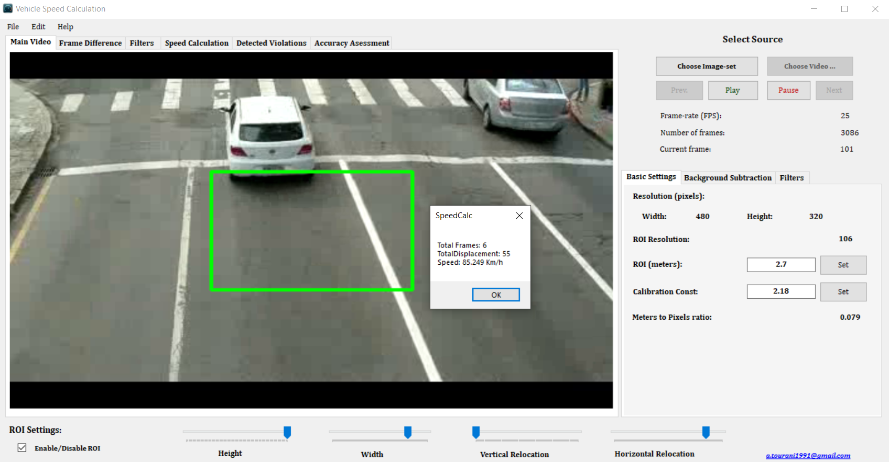
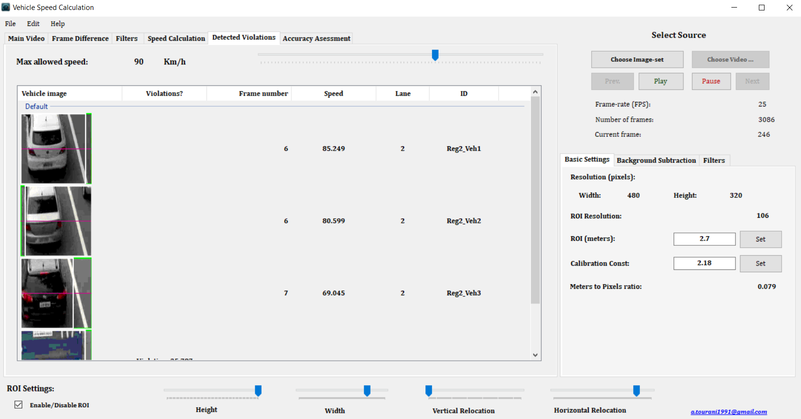

# Motion-based Vehicle Speed Measurement

This project is a vehicle speed measurement application for vision-based Intelligent Transportation Systems (ITS). These systems utilize roadway camera outputs to apply video processing techniques and extract the desired information, which is vehicle instantaneous speed in this special case. This approach is able to estimate the vehicles' speed by their **motion features** (in case a correct calibration is provided). Thus by analyzing each vehicle's motion parameters inside a pre-defined Region of Interest (ROI), the amount of displacement in sequential frames are provided, which is an essential parameter to calculate instantaneous speed.

### Algorithms
Each moving object (vehicle or non-vehicle) is detected as it enters the ROI by the means of **Mixture-of-Gaussian** background subtraction method. Then by applying **morphology transforms** including opening and closing, and FloodFill algorithm, the distinct parts of these objects turn into unified filled shapes. Then, some defined filtration functions leave behind only the objects with the highest possibility of being a vehicle. Detected vehicles are then tracked using **blob tracking **algorithm and their displacement among sequential frames are calculated for final speed measurement purpose. It should be noted that the process is not done in real-time and the outputs of the system have acceptable accuracy only if the configurations are correct based on the vehicle images/frames.

### Inputs/Outputs of the System
The input of the system can be a video (default) or a series of images which needs to be callibrated for furthur analysis and correct calculations. Calibration parameters include the ground-truth speed of each vehicle (to be compare to the calculated speed) in the format of a XML type, the real width and height of the ROI and Image processing parameters (e.g. morphology kernel sizes, gaussian filter kernel size, etc). The ouput of the system is a series of vehicle images with their corresponding speed, detected frame and the status of commiting a speeding violation.

### Environment
The project is implemented by **C#** EmguCV and AForge.Net image processing libraries.

### Sample Performance
You can see a sample performance of the system in this [link](https://www.youtube.com/watch?v=Qs-alxle-FU "link").

### Run the Project
Simply Clone the project and install the require packages by NuGet Package Manager. Here's the list of the packages:
1. EmguCV -Version 3.0.0 ([link](https://www.nuget.org/packages/EmguCV/3.0.0 "link"))
2. AForge -Version 2.2.5 ([link](https://www.nuget.org/packages/AForge/ "link"))
3. AForge.Imaging -Version 2.2.5 ([link](https://www.nuget.org/packages/AForge.Imaging/ "link"))

### Publications and CopyRight
The project was my MSc. thesis entitled "Automatic Vehicle Speeding Violation Detection using Video Processing Techniques" which has been performed in 2017-2018. Below papers have been published in this manner:
1. A. Tourani, A. Shahbahrami, A. Akoushideh, S. Khazaee, and C. Y Suen "Motion-based Vehicle Speed Measurement for Intelligent Transportation Systems," International Journal of Image, Graphics and Signal Processing, vol. 11, no. 4, pp. 42-54, 2019. ([link](https://www.researchgate.net/publication/332297032_Motion-based_Vehicle_Speed_Measurement_for_Intelligent_Transportation_Systems "link"))
2. A. Tourani, A. Shahbahrami and A. Akoushideh, "Challenges of Video-Based Vehicle Detection and Tracking in Intelligent Transportation Systems," International Conference on Soft Computing, Rudsar, 2017. ([link](https://www.researchgate.net/publication/321254958_Challenges_of_Video-Based_Vehicle_Detection_and_Tracking_in_Intelligent_Transportation_Systems "link"))
